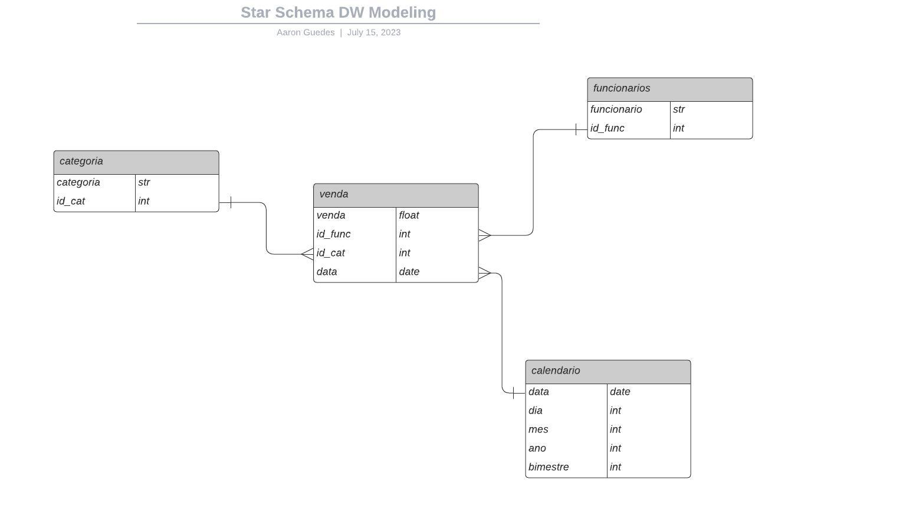
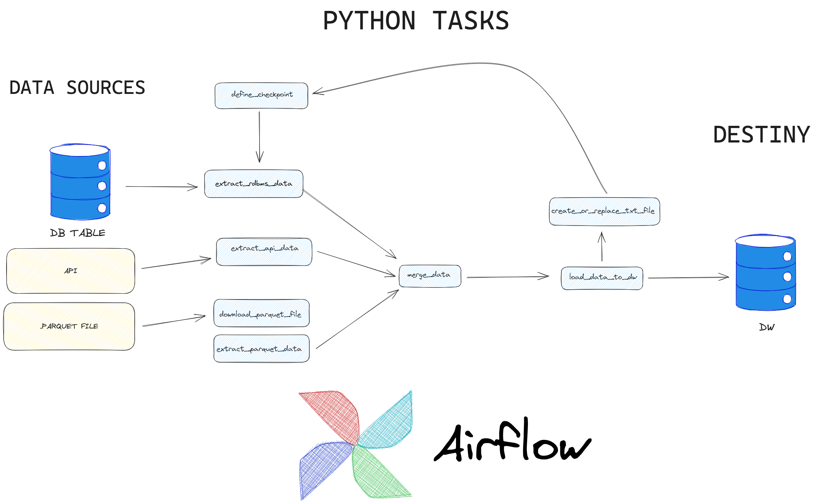

# ETL Project Documentation

This repository contains an ETL (Extract, Transform, Load) project that aims to process data from three different sources and load it into a data warehouse. The project utilizes Python, SQL, and the Airflow pipeline orchestrator.

This is a prototype of a real project that uses dummy data to exemplify how to perform ETL using Airflow.

## Project Requirements

The ETL process involves the following data sources:

- API with employee data
- .PARQUET file with category data
- PostgreSQL relational table with sales data

The chosen destination for the processed data is a Star Schema data warehouse using PostgreSQL. The ETL process is scheduled to run daily. Airflow is used as the pipeline orchestrator. The implementation is primarily done in Python, with some SQL statements.

## Environment Preparation

**Operating System (OS):**

Ubuntu 22.04

**Python:**

For this project, the open-source docker image created by Israel Gonçalves de Oliveira was used as the workspace: [ysraell/my-ds](https://github.com/ysraell/my-ds). It is based on the official Python docker image: [python](https://hub.docker.com/_/python).

- Base Image Tag: 3.10-bullseye
- Jupyter Lab was used as the IDE, and the .ipynb files were converted to .py using Jupyter nbconvert.

**Airflow:**

Airflow version 2.6.1 was installed inside the Docker image using the command `pip install airflow` in the terminal.

**PostgreSQL Data Warehouse:**

The official PostgreSQL Docker image was used locally: [postgres](https://hub.docker.com/_/postgres).

**DBeaver:**

DBeaver was used as the SQL IDE.

## Data Warehouse Modeling

The data warehouse follows a star schema modeling approach. The entity-relationship diagram (ERD) for the data warehouse is as follows:



The fact table is named **vendas** (sales), and the dimensional tables are **categoria** (category), **funcionarios** (employees), and **calendario** (calendar).

The SQL code to create the tables in the **dw_projeto** schema is as follows:

```sql
CREATE SCHEMA dw_projeto;

CREATE TABLE dw_projeto.vendas (
    venda REAL,
    id_func INTEGER,
    id_cat INTEGER,
    data DATE,
    id_venda INTEGER
);

CREATE TABLE dw_projeto.funcionarios (
    funcionario VARCHAR(50),
    id_func INTEGER
);

CREATE TABLE dw_projeto.categoria (
    categoria VARCHAR(50),
    id_cat INTEGER
);

CREATE TABLE dw_projeto.calendario (
    data DATE,
    dia INT,
    mes INT,
    ano INT,
    bimestre INT
);
```
## Solution Architecture



### Task 1: define_checkpoint

The `define_checkpoint` function is defined to determine the value of the `checkpoint` variable. It checks if a file named `checkpoint.txt` exists in the specified path. If the file does not exist, the checkpoint is set to 0. Otherwise, it reads the content of the file and assigns it to the `checkpoint` variable. The function returns the checkpoint value.

The purpose of the function is to load only new records, after the initial load, from the `public.venda` table.

### Task 2: extract_rdbms_data

The `extract_rdbms_data` function retrieves data from a PostgreSQL source database and filters it based on the checkpoint value. It connects to a PostgreSQL database using the connection named "postgresDB" defined in Airflow. The function constructs a SQL query using the checkpoint value to filter the results.

The query retrieves columns `id_venda`, `id_funcionario`, `id_categoria`, `data_venda`, and `venda` from a table named "venda" where `id_venda` is greater than the checkpoint value. The results are stored in a pandas DataFrame. The `data_venda` column is cast to a datetime data type.

The resulting DataFrame should have the following structure:

| id_venda | id_funcionario | id_categoria | data_venda | venda |
| -------- | -------------- | ------------ | ---------- | ----- |
| int      | int            | int          | date       | int   |

### Task 3: download_parquet_data and extract_parquet_data

The `extract_parquet_data` function downloads a Parquet file from a given URL using the `download_parquet_data` function. It reads the downloaded Parquet file into a pandas DataFrame and renames the column "id" to "id_categoria". The downloaded Parquet file is then removed from the file system.

A `PythonOperator` task named `'extract_parquet_data'` is created to execute the `extract_parquet_data` function.

The resulting DataFrame from the Parquet file extraction should have the following structure:

| categoria | id_categoria |
| --------- | ------------ |
| str       | int          |

### Task 4: extract_api_data

The `extract_api_data` function consumes an array of unique `id_funcionario` values and makes API requests to retrieve the corresponding employee names. It uses a base URL and appends each `id_funcionario` value to construct the API endpoint. The function sends a GET request to the API, retrieves the response text, and creates a dictionary containing the employee's name (`nome_funcionario`) and ID (`id_funcionario`). The dictionaries are then saved in a list.

After retrieving the data, the dictionary list is transformed into a DataFrame with the following structure:

| nome_funcionario | id_funcionario |
| ---------------- | -------------- |
| int              | int            |

### Task 5: merge_data

The `merge_data` function performs the data merging operation. It merges three DataFrames created before (API, Table, and Parquet).

The merge is performed based on the common columns `'id_categoria'` and `'id_funcionario'`. The function first merges the `query_venda` and `df_parquet` DataFrames on the column `'id_categoria'`. It then converts the `df_api` list of dictionaries into a DataFrame and merges it with the previously merged DataFrame on the column `'id_funcionario'`.

The resulting merged DataFrame should have the following structure:

| id_venda | venda | id_funcionario | nome_funcionario | id_categoria | nome_categoria | data_venda |
| -------- | ----- | -------------- | ---------------- | ------------- | -------------- | ---------- |
| int      | int   | int            | int              | int           | date           | date       |

### Task 6: load_data_to_dw

The `load_data_to_dw` function loads the transformed data from the `df_final` DataFrame (created in the `merge_data` task) to the destination data warehouse (DW). It connects to the destination PostgreSQL database using the connection named "dw_dest" defined in Airflow.

The function follows a dimensional modeling approach and first loads data into the dimensional tables. It extracts the columns `'nome_funcionario'` and `'id_funcionario'` from `df_final` to create the `funcionarios_data` DataFrame, which represents the `funcionarios` table. The `funcionarios_data` DataFrame is inserted into the `dw_projeto.funcionarios` table.

Similarly, the function creates the `categoria_data` DataFrame from `df_final` to represent the `categoria` table and inserts it into the `dw_projeto.categoria` table.

Next, the function creates the `calendario_data` DataFrame based on the distinct dates in `df_final`. It extracts the day, month, year, and bimestre (calculated based on the month) components from the `data_venda` column. The `calendario_data` DataFrame is then inserted into the `dw_projeto.calendario` table.

Finally, the function loads data from `df_final` into the `vendas` table, the factual table. It selects the columns `'venda'`, `'id_funcionario'`, `'id_categoria'`, `'data_venda'`, and `'id_venda'` from `df_final` and inserts the data into the `dw_projeto.vendas` table.

Here is the query to retrieve the data from the destination:

```sql
WITH venda_cat_func_date AS (
  SELECT v.id_venda, v.venda, v.id_func, f.funcionario,
         v.id_cat, c.categoria, v."data", cal.dia,
         cal.mes, cal.ano, cal.bimestre
  FROM vendas v
  LEFT JOIN categoria c ON v.id_cat = c.id_cat
  LEFT JOIN funcionarios f ON v.id_func = f.id_func
  LEFT JOIN calendario cal ON v."data" = cal."data"
)
SELECT id_venda, venda, id_func, funcionario,
       id_cat, categoria, "data", dia, mes,
       ano, bimestre
FROM venda_cat_func_date;
```

Final Result:


